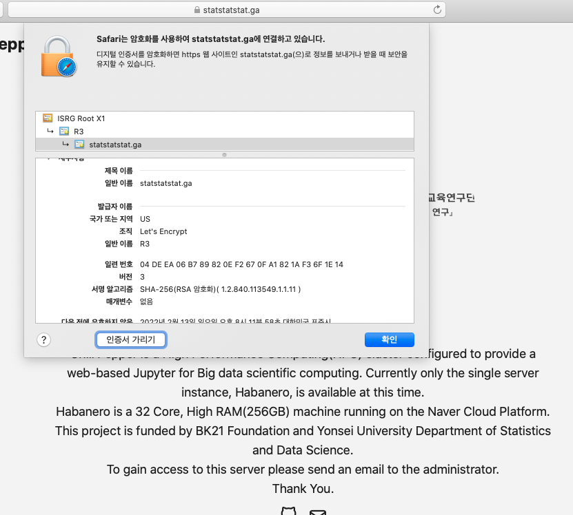

test용 도메인: https://statstatstat.ga

인증서 발급기관: Let’s encrypt

사용 도구: certbot

proxy node에서 작업

main reference: [https://anomie7.tistory.com/59#recentComments](https://anomie7.tistory.com/59#recentComments)

## 1. Docker 설치

`snap`으로 설치한 docker는 pathing issue가 있다고 함[^fn1].  따라서 삭제하고 official documentation에 의거하여 다시 설치[^fn2]

```bash
#
snap remove docker #Remove docker from snap

#Remove the docker directory, and old version (It's okay if these don't exist already)
rm -R /var/lib/docker
sudo apt-get remove docker docker-engine docker.io

```

Install the official docker package, using the repository. [^fn2]

## 2.  컨테이너 실행

```bash
sudo mkdir /var/www/statstatstat # ssl 인증서가 저장될 경로

sudo docker run --name landing_test -it -d -p 80:80 -p 443:443 -p 8080:8080 -p 7946:7946 -v /var/www/statstatstat:/var/www/statstatstat -v /mnt/nas/admin/landing-page/public:/usr/share/nginx/html/landing-page nginx

sudo docker ps # 실행 잘 되었는지 보기
```

옵션 설명:

`-d`: detached mode. 보통 데몬 모드라고 부르며 컨테이너가 백그라운드로 실행됨

`-it`

인증서가 저장된 경로, 랜딩 페이지가 저장된 경로를 연결해 줌

- 인증서가 저장된 경로
 `-v /var/www/statstatstat:/var/www/statstatstat`
- 랜딩 페이지가 저장된 경로
`-v /mnt/nas/admin/landing-page/public:/usr/share/nginx/html/landing-page`

## 3. 인증서 발급을 위해 nginx 설정

## **Certbot의 도메인 소유 인증 절차**

본격적인 발급 절차에 앞서, certbot이 어떻게 도메인의 소유권을 확인하는지 알아봅시다. 웹 서버를 통하는 방법과, DNS 레코드를 통한 방법 등 크게 두 가지로 나뉘어집니다.[fn^3]

### **웹 서버를 통한 도메인 인증**

Certbot이 직접 웹 서버를 띄운 뒤, URL을 통해 해당 웹 서버로 접속을 시도하여 도메인의 소유를 검증하는 방법입니다.

예를 들어 yourdomain.com이라는 도메인의 인증서를 발급받고자 한다면, certbot은 **`yourdomain.com/.well-known/acme-challenge`** URL을 통해 여러분의 서버에 접속하여 실제 발급을 시도 중인 서버가 맞는지 확인하게 됩니다.

- 장점
    - 대부분의 경우에 쉽고 간단합니다. 명령어 한 줄로 인증서 발급부터 nginx, haproxy 등의 리버스 프록시 인증서 셋팅까지 자동으로 해주거든요.
- 단점
    - 운영중인 환경에서 인증서를 발급받기 난감합니다. 그 이유는, **80(443) 포트로 직접 웹 서버가 떠야하기 때문**입니다. 운영중인 서비스에서 두 포트 중 하나만 사용한다면 괜찮지만, 만약 두 포트를 모두 사용하고 있다면 인증서를 발급 받기 위해 서비스를 잠시 내려야하는 치명적인 단점이 있습니다.
    - 방화벽이 엄격하게 설정된 경우에는 발급 과정이 번거롭습니다. Certbot은 접속할 URL 경로를 수동으로 지정할 수 없기 때문에, 위에서 언급한 **`.well-known/acme-challenge`** 경로를 열어주어야합니다.

### **DNS를 통한 도메인 인증**

대부분의 서비스에서 많이 사용하는 방식입니다. 인증 토큰을 TXT 레코드로 등록하여 도메인의 소유권을 인증합니다.

- 장점
    - 서버의 설정을 전혀 건드릴 필요가 없습니다. 때문에 운영중인 환경에서도 쉽게 발급이 가능합니다.
- 단점
    - DNS 레코드를 등록해주는 절차가 번거로울 수 있습니다. 개인 단위에서는 문제가 없겠지만, 단체나 회사에서 관리하는 도메인의 경우 레코드를 건드리는게 불가능할 수도 있고요.
    - DNS 전파 시간을 기다려야하는 점도 귀찮은 점 중 하나입니다.

연세대 dns의 경우 dns 레코드 등록시 TXT 레코드를 사용할 수 없으므로 1번의 방법을 사용. 일단 80번 포트로 **`.well-known/acme-challenge`** 경로를 열어줌.

```bash
sudo docker exec -it landing_test sh #컨테이너에서 bash 실행

# 컨테이너 내에서 vi 에디터 설치
apt-get update
apt-get install vim
```

nginx 설정파일을 수정해서 `www.statstatstat.ga/.well-known/acme-challenge/`로 오는 요청을  `/var/www/statstatstat` 폴더(인증서 파일이 저장된 폴더)로 매핑할 것이다.

```bash
#nginx 설정파일은 /etc/nginx/conf.d/default.conf에 위치하고 있으니 vi 명령어로 편집화면으로 들어간다.
sudo vi /etc/nginx/conf.d/default.conf
```

http{} 중괄호 안에 아래 설정을 추가한다.

```bash
location ^~ /.well-known/acme-challenge/ {                
	default_type "text/plain";                
	root /var/www/minussl;
}
```

편집화면에서 나와서 `nginx -T`로 틀린 부분은 없었는지 확인하고 없다면 `nginx -s reload`로 재실행한다.

그리고 인터넷 브라우저에서 `statstatstat.ga`로 들어가서 정상 작동되는지 확인한다.

## 4. certbot 설치

[^fn4]

```bash
sudo snap install core; sudo snap refresh core # snapd가 최신 버전이 되도록 함

# 이전에 설치되어 있던 certbot은 삭제
sudo apt-get remove certbot
sudo yum remove certbot

sudo snap install --classic certbot #설치

sudo ln -s /snap/bin/certbot /usr/bin/certbot # ensure that the certbot command can be run
```

인증서 발급

```bash
sudo certbot certonly --webroot -w /var/www/statstatstat -d statstatstat.ga
```

아래의 결과가 나옴:

```
(Y)es/(N)o: Y
Account registered.
Requesting a certificate for statstatstat.ga

Successfully received certificate.
Certificate is saved at: /etc/letsencrypt/live/statstatstat.ga/fullchain.pem
Key is saved at:         /etc/letsencrypt/live/statstatstat.ga/privkey.pem
This certificate expires on 2022-05-14.
These files will be updated when the certificate renews.
Certbot has set up a scheduled task to automatically renew this certificate in the background.
```

## 5. 인증서 파일 옮기기

 발급된 privkey.pem와 fullchain.pem 파일은 심볼릭 링크이다.

그래서 도커에서 연결이 불가능하므로 진본파일을 `/var/www/statstatstat`로 옮겨주어야한다.

1. 우선 `/etc/letsencrypt/live/statstatstat.ga`으로는 권한문제로 파일을 조회해볼 수 없다.
2. `sudo chmod +rwx` 명령어로 접근권한을 얻고 디렉토리로 가서 파일의 원본 위치를 확인해보자


1. 저 중 `fullchain1.pem`과 `privkey1.pem`을  `-v` 옵션을 주었던 폴더로 옮겨야 nginx 컨테이너에서도 인증서를 사용할 수 있다.

```bash
sudo mv ../../archive/statstatstat.ga/fullchain1.pem /var/www/statstatstat/fullchain1.pem

sudo mv ../../archive/statstatstat.ga/privkey1.pem /var/www/statstatstat/privkey1.pem
```

1. 이제 컨테이너로 접속해서 파일이 공유되는지 확인한다.

## 6. 웹서버 설정

아래와 같이 `/etc/nginx/conf.d/` 디렉토리에 `landing_test_https.conf`라는 이름으로 설정 파일을 만든다. ssl_protocols 부분에 #TLSv1.3을 써놓지 않으면 사파리, 크롬 등에서 ERR_SSL_VERSION_OR_CIPHER_MISMATCH 오류가 뜬다.

```bash
# configuration file /etc/nginx/conf.d/landing_test_https.conf:
server {
    listen       443 ssl;
    server_name statstatstat.ga;

    ssl_certificate	/var/www/statstatstat/fullchain1.pem;
    ssl_certificate_key /var/www/statstatstat/privkey1.pem;

    ssl_session_timeout 5m;
    ssl_protocols SSLv2 SSLv3 TLSv1 TLSv1.1 TLSv1.2 TLSv1.3;
			#TLSv1.3을 써놓지 않으면 사파리, 크롬 등에서 ERR_SSL_VERSION_OR_CIPHER_MISMATCH 오류가 뜸
    ssl_ciphers HIGH:!aNULL:!MD5;
    ssl_prefer_server_ciphers on;

    location / {
        root   /usr/share/nginx/html/landing-page;
        index  index.html index.htm;
    }

}
```
## 7 결과
https://statstatstat.ga 로 접속하면 정상적으로 ssl encryption이 된 것을 볼 수 있다.




### References


[^fn1]: [https://stackoverflow.com/questions/45764477/docker-compose-error-while-creating-mount-source-path](https://stackoverflow.com/questions/45764477/docker-compose-error-while-creating-mount-source-path)

[^fn2]:[https://docs.docker.com/engine/install/ubuntu/#install-using-the-repository](https://docs.docker.com/engine/install/ubuntu/#install-using-the-repository)

[^fn3]:[https://lynlab.co.kr/blog/72](https://lynlab.co.kr/blog/72)

[^fn4]:[https://certbot.eff.org/instructions?ws=nginx&os=ubuntufocal](https://certbot.eff.org/instructions?ws=nginx&os=ubuntufocal)
