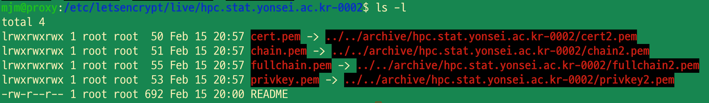

nginx를 docker 위에서 실행

도메인: [hpc.stat.yonsei.ac.kr](http://hpc.stat.yonsei.ac.kr) ([https://yis.yonsei.ac.kr/ics/service/dnsApply.do](https://yis.yonsei.ac.kr/ics/service/dnsApply.do) 에서 신청, 3년마다 갱신 필요)

인증서 발급기관: Let’s encrypt(3개월마다 갱신 필요)

사용 도구: certbot

proxy node에서 작업

main reference: [https://anomie7.tistory.com/59#recentComments](https://anomie7.tistory.com/59#recentComments)

## 1. Docker 설치

snap으로 설치하면 컨테이너 실행 시 `-v` 옵션 사용에 문제가 있으므로 docker 공식 문서에 나온 방법으로 설치해야 한다.

## 2.  컨테이너 생성

```bash
sudo mkdir /var/www/hpc.stat.yonsei.ac.kr # ssl 인증서가 저장될 경로

sudo docker run --name deploy -it -d -p 80:80 -p 443:443 -p 8080:8080 -p 7946:7946 -v /var/www/hpc.stat.yonsei.ac.kr:/var/www/hpc.stat.yonsei.ac.kr -v /mnt/nas/public/landing-page:/usr/share/nginx/html/landing-page nginx

sudo docker ps # 실행 잘 되었는지 보기
```

옵션 설명:

`-d`: detached mode. 보통 데몬 모드라고 부르며 컨테이너가 백그라운드로 실행됨

`-it`

인증서가 저장된 경로, 랜딩 페이지가 저장된 경로를 연결해 줌

- 인증서가 저장된 경로
  `-v /var/www/hpc.stat.yonsei.ac.kr:/var/www/hpc.stat.yonsei.ac.kr`
- 랜딩 페이지가 저장된 경로
  `-v /mnt/nas/public/landing-page:/usr/share/nginx/html/landing-page`

## 3. 인증서 발급을 위해 nginx 설정 (최초 발급시)

## **(참고)Certbot의 도메인 소유 인증 절차**

본격적인 발급 절차에 앞서, certbot이 어떻게 도메인의 소유권을 확인하는지 알아봅시다. 웹 서버를 통하는 방법과, DNS 레코드를 통한 방법 등 크게 두 가지로 나뉘어집니다.[fn^3]

### **웹 서버를 통한 도메인 인증**

Certbot이 직접 웹 서버를 띄운 뒤, URL을 통해 해당 웹 서버로 접속을 시도하여 도메인의 소유를 검증하는 방법입니다.

예를 들어 yourdomain.com이라는 도메인의 인증서를 발급받고자 한다면, certbot은 **`yourdomain.com/.well-known/acme-challenge`** URL을 통해 여러분의 서버에 접속하여 실제 발급을 시도 중인 서버가 맞는지 확인하게 됩니다.

- 장점
  - 대부분의 경우에 쉽고 간단합니다. 명령어 한 줄로 인증서 발급부터 nginx, haproxy 등의 리버스 프록시 인증서 셋팅까지 자동으로 해주거든요.
- 단점
  - 운영중인 환경에서 인증서를 발급받기 난감합니다. 그 이유는, **80(443) 포트로 직접 웹 서버가 떠야하기 때문**입니다. 운영중인 서비스에서 두 포트 중 하나만 사용한다면 괜찮지만, 만약 두 포트를 모두 사용하고 있다면 인증서를 발급 받기 위해 서비스를 잠시 내려야하는 치명적인 단점이 있습니다.
  - 방화벽이 엄격하게 설정된 경우에는 발급 과정이 번거롭습니다. Certbot은 접속할 URL 경로를 수동으로 지정할 수 없기 때문에, 위에서 언급한 **`.well-known/acme-challenge`** 경로를 열어주어야합니다.

### **DNS를 통한 도메인 인증**

대부분의 서비스에서 많이 사용하는 방식입니다. 인증 토큰을 TXT 레코드로 등록하여 도메인의 소유권을 인증합니다.

- 장점
  - 서버의 설정을 전혀 건드릴 필요가 없습니다. 때문에 운영중인 환경에서도 쉽게 발급이 가능합니다.
- 단점
  - DNS 레코드를 등록해주는 절차가 번거로울 수 있습니다. 개인 단위에서는 문제가 없겠지만, 단체나 회사에서 관리하는 도메인의 경우 레코드를 건드리는게 불가능할 수도 있고요.
  - DNS 전파 시간을 기다려야하는 점도 귀찮은 점 중 하나입니다.

연세대 dns의 경우 dns 레코드 등록시 TXT 레코드를 사용할 수 없으므로 1번의 방법을 사용. 일단 80번 포트로 **`.well-known/acme-challenge`** 경로를 열어줌.

```bash
sudo docker exec -it deploy sh #deploy 컨테이너 속에서 bash 실행

# 컨테이너 내에서 vi 에디터 설치
apt-get update
apt-get install vim
```

nginx 설정파일을 수정해서 `www.hpc.stat.yonsei.ac.kr/.well-known/acme-challenge/`로 오는 요청을  `/var/www/hpc.stat.yonsei.ac.kr` 폴더(인증서 파일이 저장된 폴더)로 매핑할 것이다.

```bash
#nginx 설정파일은 /etc/nginx/conf.d/default.conf에 위치하고 있으니 vi 명령어로 편집화면으로 들어간다.
vi /etc/nginx/conf.d/default.conf
```

기본 설정 파일을 다음과 같이 추가한다. 기존의 location/ 블록 아래에 병렬적으로 추가하면 된다.

```bash
server {
    listen       80;
    server_name  localhost;

    #access_log  /var/log/nginx/host.access.log  main;

    location / {
        root   /usr/share/nginx/html/landing-page;
        index  index.html index.htm;
        default_type "text/plain";                
    }
    location ^~ /.well-known/acme-challenge/ {                
        default_type "text/plain";                
        root /var/www/hpc.stat.yonsei.ac.kr;
    }
```

`exit`를 입력하고 편집화면에서 나와서 `nginx -T`로 틀린 부분은 없었는지 확인하고 없다면 `nginx -s reload`로 재실행한다.

그리고 인터넷 브라우저에서 [`http://hpc.stat.yonsei.ac.kr`](http://hpc.stat.yonsei.ac.kr) 로 들어가서 정상 작동되는지 확인한다.

## 4. certbot 설치, 인증서 발급

**컨테이너에서 나와서(꼭 나와야 함!)** host에서 certbot을 설치하고 인증서 발급을 진행한다.
[^fn4]

```bash
sudo snap install core; sudo snap refresh core # snapd가 최신 버전이 되도록 함

# 이전에 설치되어 있던 certbot은 삭제
sudo apt-get remove certbot
sudo yum remove certbot

sudo snap install --classic certbot #설치

sudo ln -s /snap/bin/certbot /usr/bin/certbot # ensure that the certbot command can be run
```

인증서 발급

갱신할 때는 
```sudo rm -rf /etc/letsencrypt/```
로 폴더를 지우고 다시 깨끗하게 처음으로 돌아가 이메일 입력을 요구하는 단계부터 시작하는 것이 마음 편하다.

```bash
sudo certbot certonly --webroot -w /var/www/hpc.stat.yonsei.ac.kr -d hpc.stat.yonsei.ac.kr
```

아래의 결과가 나옴:

```
mjm@proxy:/var/www/hpc.stat.yonsei.ac.kr$ sudo certbot certonly --webroot -w /var/www/hpc.stat.yonsei.ac.kr -d hpc.stat.yonsei.ac.kr
Saving debug log to /var/log/letsencrypt/letsencrypt.log
Requesting a certificate for hpc.stat.yonsei.ac.kr

Successfully received certificate.
Certificate is saved at: /etc/letsencrypt/live/hpc.stat.yonsei.ac.kr/fullchain.pem
Key is saved at:         /etc/letsencrypt/live/hpc.stat.yonsei.ac.kr/privkey.pem
This certificate expires on 2022-05-15.
These files will be updated when the certificate renews.
Certbot has set up a scheduled task to automatically renew this certificate in the background.
```

만약 기존에 발급한 만료되지 않은 인증서가 이 컴퓨터에 존재한다면, 아래와 같은 메시지가 나온다.

```
Saving debug log to /var/log/letsencrypt/letsencrypt.log
Certificate not yet due for renewal

You have an existing certificate that has exactly the same domains or certificate name you requested and isn't close to expiry.
(ref: /etc/letsencrypt/renewal/hpc.stat.yonsei.ac.kr-0002.conf)

What would you like to do?
- - - - - - - - - - - - - - - - - - - - - - - - - - - - - - - - - - - - - - - -
1: Keep the existing certificate for now
2: Renew & replace the certificate (may be subject to CA rate limits)
```

2를 선택해서 renew한다(CA rate limits에 대해서는 추후에 조사...)

아래와 같은 결과가 나온다.

```
Successfully received certificate.
Certificate is saved at: /etc/letsencrypt/live/hpc.stat.yonsei.ac.kr-0002/fullchain.pem
Key is saved at:         /etc/letsencrypt/live/hpc.stat.yonsei.ac.kr-0002/privkey.pem
This certificate expires on 2022-05-16.
These files will be updated when the certificate renews.
Certbot has set up a scheduled task to automatically renew this certificate in the background.
```

## 5. 인증서 파일 옮기기

발

- 발급된 privkey.pem와 fullchain.pem 파일 원본은 /etc/letsencrypt/archive/hpc.stat.yonsei.ac.kr에 있다.
- 도커 외부의 `/etc/letsencrypt/live/hpc.stat.yonsei.ac.kr`에 있는 파일들은 심볼릭 링크일 뿐이다.
- 도커에서는 심볼릭 링크는 연결할 수 없다. 따라서 외부에서 원본 파일을 도커와 연결된 `/var/www/hpc.stat.yonsei.ac.kr`로 옮긴다.

위에서 
Successfully received certificate.
Certificate is saved at: ...
Key is saved at: ...
에서 ...에 써 있는 경로로(재발급 받았다면 경로가 달라질 수 있으니, 성공 메시지에 나온 경로를 꼭 확인한다) 간 다음에, ls -l로 파일의 원본 위치를 확인하고 그 원본 파일을 `/var/www/hpc.stat.yonsei.ac.kr`로 옮길 것이다.

1. 위 경로에서는 권한문제로 파일을 조회해볼 수 없다.
2. `sudo chmod +rwx` 명령어로 접근권한을 얻고 디렉토리로 가서 파일의 원본 위치를 확인해보자

```bash
cd /etc/letsencrypt/
sudo chmod +rwx live
cd ./live/hpc.stat.yonsei.ac.kr
ls -l
```



저 중 `fullchain1.pem`과 `privkey1.pem`(재발급 받았다면 뒤에 다른번호가 붙어있을 수 있음)을  `-v` 옵션을 주었던 폴더로 옮겨야 nginx 컨테이너에서도 인증서를 사용할 수 있다.
원본 파일의 경로는 ../../archive/hpc.stat.yonsei.ac.kr-0002/fullchain2.pem 와 같은 형식이고,
옮길 위치는 /var/www/hpc.stat.yonsei.ac.kr/이다.

```bash
sudo mv  ../../archive/hpc.stat.yonsei.ac.kr/fullchain1.pem /var/www/hpc.stat.yonsei.ac.kr/fullchain1.pem

sudo mv ../../archive/hpc.stat.yonsei.ac.kr/privkey1.pem /var/www/hpc.stat.yonsei.ac.kr/privkey1.pem
```

 이제 컨테이너로 접속해서 파일이 공유되는지 확인한다.

```bash
sudo docker exec -it deploy sh #deploy 컨테이너 속에서 bash 실행
cd /var/www/hpc.stat.yonsei.ac.kr
```

## 6. 웹서버 설정

아래와 같이 `/etc/nginx/conf.d/` 디렉토리에 `landing_test_https.conf`라는 이름으로 설정 파일을 만든다. ssl_protocols 부분에 #TLSv1.3을 써놓지 않으면 사파리, 크롬 등에서 ERR_SSL_VERSION_OR_CIPHER_MISMATCH 오류가 뜬다.

ssl_certificate 부분에 아까 옮긴 pem 파일들의 이름을 써 줘야 한다. 재발급 받았으면 파일 이름 뒤의 번호가 바뀐다는 점에 주의한다.

```bash
sudo docker exec -it landing_page sh

vi /etc/nginx/conf.d/landing_page_https.conf

#파일 내용:
# configuration file /etc/nginx/conf.d/landing_test_https.conf:
server {
    listen       443 ssl;
    server_name hpc.stat.yonsei.ac.kr;

    ssl_certificate    /var/www/hpc.stat.yonsei.ac.kr/fullchain1.pem;
    ssl_certificate_key /var/www/hpc.stat.yonsei.ac.kr/privkey1.pem;

    ssl_session_timeout 5m;
    ssl_protocols SSLv2 SSLv3 TLSv1 TLSv1.1 TLSv1.2 TLSv1.3;
            #TLSv1.3을 써놓지 않으면 사파리, 크롬 등에서 ERR_SSL_VERSION_OR_CIPHER_MISMATCH 오류가 뜸
    ssl_ciphers HIGH:!aNULL:!MD5;
    ssl_prefer_server_ciphers on;

    location / {
        root   /usr/share/nginx/html/landing-page;
        index  index.html index.htm;
    }

}
```

nginx -T로 설정 오류 있는지 확인하고, nginx -s reload로 재시작한다.

## 7. HTTP redirect

우선, certbot ssl 인증을 위해 사용했던  [localhost](http://localhost) server 설정이 들어 있는 default.conf 파일을 nginx.conf가 참조하지 못하도록 파일명을 바꿔 놓는다.

```bash
sudo mv /etc/nginx/conf.d/default.conf /etc/nginx/conf.d/default.conf.dormant
```

```bash
vi /etc/nginx/conf.d/landing_page_https.conf
기존의 server block 아래에 병렬적으로 아래 블록을 추가한다.
#아래 블록을 추가한다.
server{
    listen 80;
    server_name hpc.stat.yonsei.ac.kr;
    root html;
    location / {
        return 301 https://hpc.stat.yonsei.ac.kr$request_uri;
        }
}
```

[^fn5]
nginx -s reload로 재시작한다.

## 4. 인증서 갱신 및 재발급

### 4.1. default.conf 파일 재활성화

컨테이너 속으로 들어간 다음 nginx의 설정 파일 디렉토리로 이동한다.

```bash
sudo docker exec -it deploy sh #deploy 컨테이너 속에서 bash 실행

mv  /etc/nginx/conf.d/default.conf.dormant /etc/nginx/conf.d/default.conf
mv /etc/nginx/conf.d/landing_page_https.conf /etc/nginx/conf.d/landing_page_https.conf.dormant
```

`nginx -T`로 틀린 부분은 없었는지 확인하고 없다면 `nginx -s reload`로 재실행한다.

그리고 인터넷 브라우저에서 [`http://hpc.stat.yonsei.ac.kr`](http://hpc.stat.yonsei.ac.kr) 로 들어가서 정상 작동되는지 확인한다.

## 4.2. 기존 인증서 파일 삭제

exit로 컨테이너에서 빠져나온다. 아래 코드를 복사해서 붙여넣어 실해한다.

```
sudo rm -rf /etc/letsencrypt/
sudo rm /var/www/hpc.stat.yonsei.ac.kr/fullchain1.pem
sudo rm /var/www/hpc.stat.yonsei.ac.kr/privkey1.pem
```

## 4.2. certbot 설치, 인증서 발급**컨테이너에서 나와서**

host에서 certbot을 설치하고 인증서 발급을 진행한다.
[^fn4]

인증서 발급갱신할 때는 ` 로 폴더를 지우고 다시 깨끗하게 처음으로 돌아가 이메일 입력을 요구하는 단계부터 시작하는 것이 마음 편하다.

```bash
sudo certbot certonly --webroot -w /var/www/hpc.stat.yonsei.ac.kr -d hpc.stat.yonsei.ac.kr
```

아래의 결과가 나오면 안내를 따라 이메일을 입력한다.

```
mjm@proxy:~$ sudo certbot certonly --webroot -w /var/www/hpc.stat.yonsei.ac.kr -d hpc.stat.yonsei.ac.kr
Saving debug log to /var/log/letsencrypt/letsencrypt.log
Enter email address (used for urgent renewal and security notices)
 (Enter 'c' to cancel):
```

그리고 안내에 따라 두 번 Y를 입력하면 아래와 같은 결과가 나온다.

```
Account registered.
Requesting a certificate for hpc.stat.yonsei.ac.kr

Successfully received certificate.
Certificate is saved at: /etc/letsencrypt/live/hpc.stat.yonsei.ac.kr/fullchain.pem
Key is saved at:         /etc/letsencrypt/live/hpc.stat.yonsei.ac.kr/privkey.pem
This certificate expires on 2023-04-19.
These files will be updated when the certificate renews.
Certbot has set up a scheduled task to automatically renew this certificate in the background.

- - - - - - - - - - - - - - - - - - - - - - - - - - - - - - - - - - - - - - - -
If you like Certbot, please consider supporting our work by:
 * Donating to ISRG / Let's Encrypt:   https://letsencrypt.org/donate
 * Donating to EFF:                    https://eff.org/donate-le
```

## 4.3. 인증서 파일 옮기기

- 발급된 privkey.pem와 fullchain.pem 파일 원본은 /etc/letsencrypt/archive/hpc.stat.yonsei.ac.kr에 있다.
- 도커 외부의 `/etc/letsencrypt/live/hpc.stat.yonsei.ac.kr`에 있는 파일들은 심볼릭 링크일 뿐이다.
- 도커에서는 심볼릭 링크는 연결할 수 없다. 따라서 외부에서 원본 파일을 도커와 연결된 `/var/www/hpc.stat.yonsei.ac.kr`로 옮긴다.

위에서 
Successfully received certificate.
Certificate is saved at: ...
Key is saved at: ...
에서 ...에 써 있는 경로로(재발급 받았다면 경로가 달라질 수 있으니, 성공 메시지에 나온 경로를 꼭 확인한다) 간 다음에, ls -l로 파일의 원본 위치를 확인하고 그 원본 파일을 `/var/www/hpc.stat.yonsei.ac.kr`로 옮길 것이다.

1. 위 경로에서는 권한문제로 파일을 조회해볼 수 없다.
2. `sudo chmod +rwx` 명령어로 접근권한을 얻고 디렉토리로 가서 파일의 원본 위치를 확인해 보자.

```bash
cd /etc/letsencrypt/
sudo chmod +rwx live
cd ./live/hpc.stat.yonsei.ac.kr
ls -l
```

아래와 같이 4개의 파일이 나온다.

```bash
mjm@proxy:/etc/letsencrypt/live/hpc.stat.yonsei.ac.kr$ ls -l
total 4
lrwxrwxrwx 1 root root  45 Jan 19 16:01 cert.pem -> ../../archive/hpc.stat.yonsei.ac.kr/cert1.pem
lrwxrwxrwx 1 root root  46 Jan 19 16:01 chain.pem -> ../../archive/hpc.stat.yonsei.ac.kr/chain1.pem
lrwxrwxrwx 1 root root  50 Jan 19 16:01 fullchain.pem -> ../../archive/hpc.stat.yonsei.ac.kr/fullchain1.pem
lrwxrwxrwx 1 root root  48 Jan 19 16:01 privkey.pem -> ../../archive/hpc.stat.yonsei.ac.kr/privkey1.pem
-rw-r--r-- 1 root root 692 Jan 19 16:01 README
```

여기 있는  `fullchain1.pem`과 `privkey1.pem`을 `-v` 옵션을 주었던 폴더로 옮겨야 nginx 컨테이너에서도 인증서를 사용할 수 있다.
원본 파일의 경로는 ../../archive/hpc.stat.yonsei.ac.kr/fullchain1.pem 와 같은 형식이고,
옮길 위치는 /var/www/hpc.stat.yonsei.ac.kr/이다.

```bash
sudo mv  ../../archive/hpc.stat.yonsei.ac.kr/fullchain1.pem /var/www/hpc.stat.yonsei.ac.kr/fullchain1.pem
sudo mv ../../archive/hpc.stat.yonsei.ac.kr/privkey1.pem /var/www/hpc.stat.yonsei.ac.kr/privkey1.pem
```

이제 컨테이너로 접속해서 파일이 공유되는지 확인한다.

```bash
sudo docker exec -it deploy sh #deploy 컨테이너 속에서 bash 실행
cd /var/www/hpc.stat.yonsei.ac.kr
ls
```

아래와 같이 파일 목록이 나타나면 성공한 것이다.

```bash
fullchain1.pem    privkey1.pem  vi
```

## 4.4. landing_page_https.conf 파일 재활성화

```bash
mv /etc/nginx/conf.d/default.conf /etc/nginx/conf.d/default.conf.dormant
mv /etc/nginx/conf.d/landing_page_https.conf.dormant /etc/nginx/conf.d/landing_page_https.conf
```

`nginx -T`로 틀린 부분은 없었는지 확인하고 없다면 `nginx -s reload`로 재실행한다.

## 4.5. HTTP redirect

우선, certbot ssl 인증을 위해 사용했던 [localhost](http://localhost) server 설정이 들어 있는 default.conf 파일을 nginx.conf가 참조하지 못하도록 파일명을 바꿔 놓는다.

```bash
vi /etc/nginx/conf.d/landing_page_https.conf
기존의 server block 아래에 병렬적으로 아래 블록을 추가한다.
#아래 블록을 추가한다.
server{
    listen 80;
    server_name hpc.stat.yonsei.ac.kr;
    root html;
    location / {
        return 301 https://hpc.stat.yonsei.ac.kr$request_uri;
        }
}
```

[^fn5]
nginx -s reload로 재시작한다.

### References

[http://digitalpioneer.net](http://digitalpioneer.net/)

[^fn1]: [https://stackoverflow.com/questions/45764477/docker-compose-error-while-creating-mount-source-path](https://stackoverflow.com/questions/45764477/docker-compose-error-while-creating-mount-source-path)

[^fn2]:[https://docs.docker.com/engine/install/ubuntu/#install-using-the-repository](https://docs.docker.com/engine/install/ubuntu/#install-using-the-repository)

[^fn3]:[https://lynlab.co.kr/blog/72](https://lynlab.co.kr/blog/72)

[^fn4]:[https://certbot.eff.org/instructions?ws=nginx&os=ubuntufocal](https://certbot.eff.org/instructions?ws=nginx&os=ubuntufocal)

[^fn5]: https://www.lesstif.com/system-admin/nginx-http-https-force-redirect-to-ssl-113344694.html
