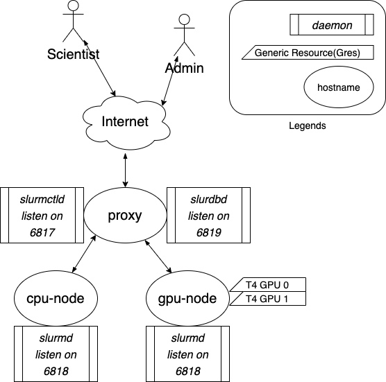
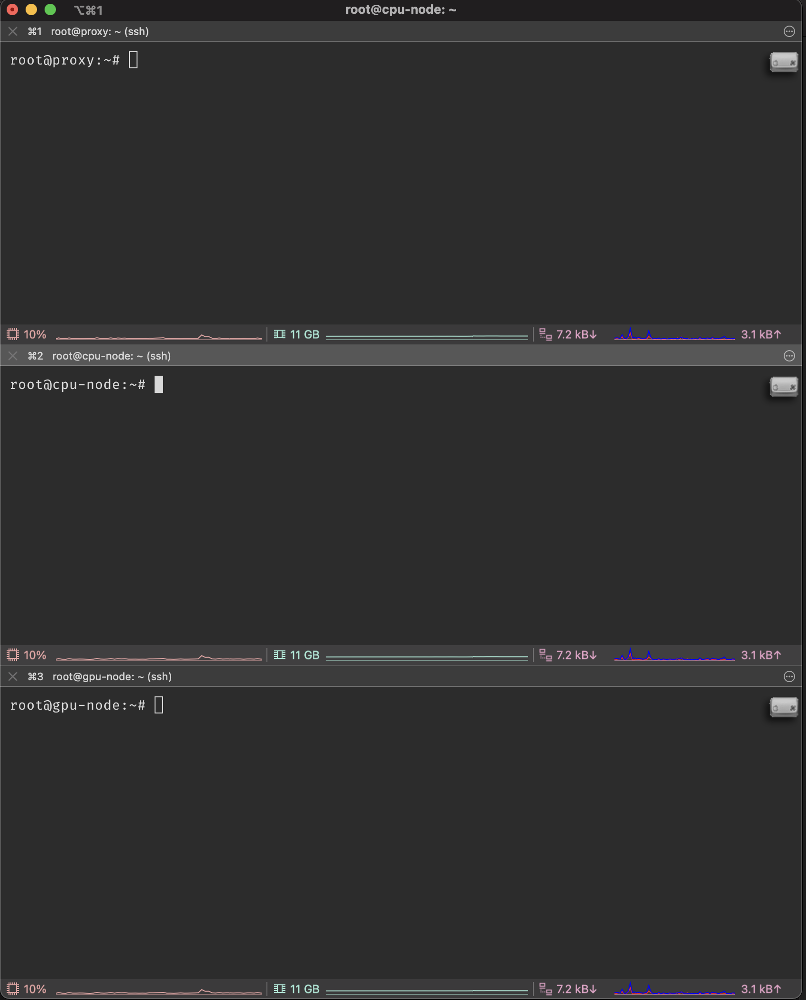
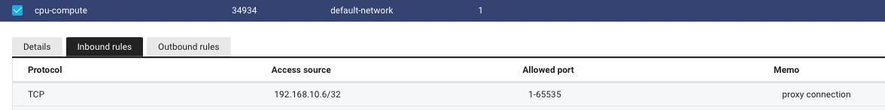

## Slurm

Slurm is a HPC job manager/scheduler that enables multiple scientists to use high performance computing clusters by submitting jobs(scripts to run for a certain time and resource configuration). The official documentation is very concise and therefore lacks some detail on configuring a custom cluster environment. This document aims sysadmins or users to understand the concept of slurm and its basic functionality along with naver cloud implementation.

## Introduction

Three main daemons of slurm are `slurmctld`, `slurmdbd` and `slurmd`. `slurmctld` and `slurmdbd` are services for the *head* server instance. In our configuration, this instance will be refered as the "proxy" server. `slurmctld` controls jobs and queues for the entire cluster based on the same `slurm.conf` configuration file across all cluster components. `slurmdbd` is an optional service which helps user management using a relational database. `slurmd` is the slurm daemon that runs on compute nodes. Users can view various information of the cluster such as the job queue, cluster information and submit jobs from any cluster. The hierarchy structure of the current network follows.

The current resource of the **chilipepper** cluster follows.

- HostName: proxy
  - CPU: 2
  - RAM: 2GB
  - Private IP: 192.168.10.6
- HostName: cpu-node
  - CPU: 32
  - RAM: 128GB
  - Private IP: 192.168.10.7
- HostName: gpu-node
  - CPU: 16
  - RAM: 80GB
  - GPU: 2x Nvidia T4(16GB vRAM)
  - Private IP: 192.168.10.8




## System Setup & Configuration

To connect all resources in a private network, a common configuration file stating various information of the head instance and child nodes is required. A very usefull terminal emulator for cluster configuration is [iTerm2](https://iterm2.com). This enables input sharing across all sessions. The following instructions are ran in `root`.



While the terminal sessions are configured as above, administrators can follow the following steps for basic Slurm configuration.

0. Network Configuration
1. Daemon User Configuration
2. Munge Installation and synchronization

### Network Configuration

Prior to the installation process, the network settings for instances must be configured according to the hierarchy. The `proxy` node should accept connections from `cpu-node` and `gpu-node`.





Then establish `ssh` connections via `ssh-copy-id` between `proxy <-> cpu-node` and `proxy <-> gpu-node`.

### User/Group Configuration

- Create `slurm` user and `slurm` group 

```bash
adduser slurm 
```

- Edit the `slurm` line in `/etc/passwd` to the following way. Note that `<UID>,<GID>` should be same for all servers.

```txt
slurm:x:<UID>:<GID>::/nonexistent:/usr/sbin/nologin
```

### Munge installation and synchronization

- Install packages from apt.
```bash
apt install -y libmunge-dev libmunge2 munge
```

- Only in the head node terminal, create a `munge.key` to share among the cluster. 
```bash
# ONLY IN THE HEAD NODE
create-munge-key # creates file /etc/munge/munge.key
```

- Copy `/etc/munge/munge.key` from the head server to the child nodes in the same directory via `scp` or by putting it in a network attached storage. The `chilipepper` cluster has a NAS mounted on `/mnt/nas` across all servers.

```bash
# From proxy server
cp /etc/munge/munge.key /mnt/nas/ # copies munge.key to /mnt/nas/
```

```bash
# From child servers
cp /mnt/nas/munge.key /etc/munge/
chmod 400 /etc/munge/munge.key # change file permissions of munge.key file
chown munge /etc/munge/munge.key # change ownership of munge.key file
chgrp munge /etc/munge/munge.key # change group of munge.key file
```

- Start and enable `munge` as a service.

```bash
/etc/init.d/munge start
systemctl enable munge.service
systemctl restart munge.service
```

- Check encoding and decoding locally and between servers.

```bash
# FROM HEAD NODE
munge -n | unmunge # locally generate encoded credential to stdout and decode
munge -n | ssh <cpu-node> unmunge # remotely decode
munge -n | ssh <gpu-node> unmunge
```

### Slurm Installation and Congiruation

The latest version of slurm can be downloaded via the following link;https://www.schedmd.com/downloads.php. Note that packaged version for Ubuntu is also available according to [Slurm download docs](https://slurm.schedmd.com/download.html). In this document we will go through the installation by compiling manually.


1. Download tarball and decompress.
```bash
# FOR ALL SERVERS
wget https://download.schedmd.com/slurm/slurm-21.08.5.tar.bz2
tar --bzip -x -f slurm-21.08.5.tar.bz2
```

2. Build slurm.
```bash
cd slurm-21.08.5/
.configure # default prefix: /usr/local/, sysconfdir: /usr/local/etc, 
make # compile
make install # install programs, docs, libraries
```

3. Initialize various files for the `slurm` daemons and change ownership and user `slurm` group.
```bash
# FOR ALL SERVERS
# create files
touch /var/run/slurmctld.pid
touch /var/run/slurmd.pid
mkdir /var/spool/slurmctld
mkdir /var/spool/slurmd
touch /usr/local/etc/slurm.conf
touch /usr/local/etc/cgroup.conf
touch /usr/local/etc/gres.conf

# change ownership & membership of slurm
chown slurm /var/spool/slurmd
chown slurm /var/spool/slurmctld
chown slurm /var/run/slurmctld.pid
chown slurm /var/run/slurmd.pid
chown slurm /usr/local/lib/libslurm.a
chown slurm /usr/local/lib/libslurm.la
chown slurm /usr/local/lib/libslurm.so*
chown slurm /usr/local/lib/slurm

chmod 775 /var/spool/slurmd
chmod 775 /var/spool/slurmctld
chmod 775 /var/run/slurmctld.pid
chmod 775 /var/run/slurmd.pid
chmod 775 /usr/local/lib/libslurm.a
chmod 775 /usr/local/lib/libslurm.la
chmod 775 /usr/local/lib/libslurm.so*
chmod 775 /usr/local/lib/slurm

usermod -aG syslog slurm
```

4. Create `slurm.conf` file from the online slurm configuration tool. Server resources for the configuration file can be queried by the following command.
```bash
# FOR ALL Servers
slurmd -C # check server configuration
vi /usr/local/etc/slurm.conf # edit slurm.conf

# in our current setting, the slurm.conf file is located at 
vi /etc/slurm-llnl/slurm.conf 
```

```txt
# /usr/local/etc/slurm.conf
# slurm.conf file generated by configurator easy.html.
# Put this file on all nodes of your cluster.
# See the slurm.conf man page for more information.
#
ClusterName=chilipepper
SlurmctldHost=proxy(192.168.10.6)
#
#MailProg=/bin/mail
MpiDefault=none
#MpiParams=ports=#-#
ProctrackType=proctrack/cgroup
ReturnToService=1
SlurmctldPidFile=/var/run/slurmctld.pid
#SlurmctldPort=6817
SlurmdPidFile=/var/run/slurmd.pid
#SlurmdPort=6818
SlurmdSpoolDir=/var/spool/slurmd
SlurmUser=slurm
#SlurmdUser=root
StateSaveLocation=/var/spool/slurmctld
SwitchType=switch/none
TaskPlugin=task/affinity
#
#
# TIMERS
KillWait=30
MinJobAge=300
SlurmctldTimeout=120
SlurmdTimeout=300
#
#
# SCHEDULING
SchedulerType=sched/backfill
SelectType=select/cons_tres
SelectTypeParameters=CR_CPU_Memory
#
#
# LOGGING AND ACCOUNTING
AccountingStorageType=accounting_storage/none
#JobAcctGatherFrequency=30
JobAcctGatherType=jobacct_gather/none
#SlurmctldDebug=info
SlurmctldLogFile=/var/log/slurmctld.log
#SlurmdDebug=info
SlurmdLogFile=/var/log/slurmd.log
#
#
# COMPUTE NODES
GresTypes=gpu
NodeName=cpu-node NodeAddr=192.168.10.7 CPUs=32 RealMemory=128917 Sockets=1 CoresPerSocket=32 ThreadsPerCore=1 State=UNKNOWN
NodeName=gpu-node Gres=gpu:2 NodeAddr=192.168.10.8 CPUs=16 RealMemory=80533 Sockets=1 CoresPerSocket=16 ThreadsPerCore=1 State=UNKNOWN
PartitionName=all Nodes=ALL Default=YES MaxTime=INFINITE State=UP
```

5. Create necessary links and cache to the recent shared libraries via `ldconfig`.

```bash
ldconfig -n /usr/local/lib
```

6. Initiate `slurmctld` and `slurmd` services.

```bash
# Only for head(proxy) node
/etc/init.d/slurmctld start
systemctl enable slurmctld
systemctl restart slurmctld
```

```bash
# For child nodes
/etc/init.d/slurmd start
systemctl enable slurmd
systemctl restart slurmd
```

7. (Additional Debugging) while error occurs during the configuration, the following command starts the `slurm` daemons in the foreground with detailed logs. When `slurmctld -Dvvvv` runs on debug mode, it will try to establish connections to child nodes. It will continuously fail until `slurmd -Dvvvv` is initiated on those nodes.

```bash
# Only for head(proxy) node
slurmctld -Dvvvv # 4 v's specify the most detail for debugging
```

```bash
# For child nodes
slurmcd -Dvvvv
```

8. After establishing cluster connection via `systemd` or the debugging step, the node status can be queried with the following command.

```bash
scontrol show node --all
```

## Slurm Account Management

1. Install `mariadb-server`. Upon installation enter the password for the `root` user of `mariadb`.
```bash
apt install mariadb-server
```

2. Enable and start the mariadb service.
```bash
systemctl enable mariadb
systemctl start mariadb
```

3. Create and configure `slurm_acct_db` database.

```bash
# login to mysql as root
mysql -u root -p
```

```mysql
mysql> grant all on slurm_acct_db.* TO 'slurm'@'localhost' identified by 'some_password' with grant option;
mysql> create database slurm_acct_db;
```

4. Configure `slurmdbd.conf`.
```bash
vi /usr/local/etc/slurmdbd.conf
```

```txt
# /usr/local/etc/slurmdbd.conf
AuthType=auth/munge
  DbdAddr=192.168.10.6
  DbdHost=proxy
  SlurmUser=slurm
  DebugLevel=4
  LogFile=/var/log/slurm/slurmdbd.log
  PidFile=/var/run/slurmdbd.pid
  StorageType=accounting_storage/mysql
  StorageHost=proxy
  StoragePass=some_password
  StorageUser=slurm
  StorageLoc=slurm_acct_db
```

5. Enable and start `slurmdbd.service`.
```bash
systemctl enable slurmdbd
systemctl start slurmdbd
```

## Choose select plugin
The select plugin is responsible for selecting compute resources to be allocated to a job, plus allocating and deallocating those resources[^fn1].

-  The `select/linear` plugin allocates whole nodes to jobs and is the simplest implementation.
-  The `select/cons_res` plugin (cons_res is an abbreviation for consumable resources) can allocate individual sockets, cores, threads, or CPUs within a node. The select/cons_res plugin is slightly slower than select/linear, but contains far more complex logic.

Since we have only two nodes, we have no choice but choose `cons_res` type.[^fn2][^fn3]


## Resources

- https://slurm.schedmd.com/overview.html
- https://slurm.schedmd.com/quickstart_admin.html
- https://southgreenplatform.github.io/trainings/hpc/slurminstallation/
- https://repository.kisti.re.kr/bitstream/10580/6542/1/2014-147%20Slurm%20관리자%20이용자%20가이드.pdf


# References
[^fn1]: https://slurm.schedmd.com/select_design.html
[^fn2]: https://stackoverflow.com/questions/51363097/slurmall-cpus-in-a-node-are-allocated-by-a-job-which-just-need-a-subset-of-cpus
[^fn3]: https://stackoverflow.com/questions/49466020/specify-number-of-cpus-for-a-job-on-slurm