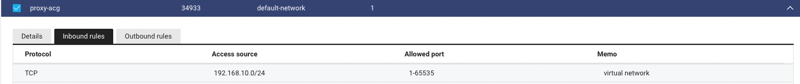
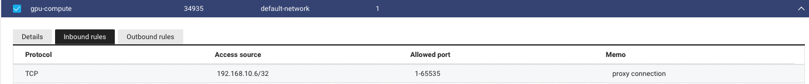

## Slurm

Slurm is a HPC job manager/scheduler that enables multiple scientists to use high performance computing clusters by submitting jobs(scripts to run for a certain time and resource configuration). The official documentation is very concise and therefore lacks some detail on configuring a custom cluster environment. This document aims sysadmins or users to understand the concept of slurm and its basic functionality along with naver cloud implementation.

## Introduction

Three main daemons of slurm are `slurmctld`, `slurmdbd` and `slurmd`. `slurmctld` and `slurmdbd` are services for the *head* server instance. In our configuration, this instance will be refered as the "proxy" server. `slurmctld` controls jobs and queues for the entire cluster based on the same `slurm.conf` configuration file across all cluster components. `slurmdbd` is an optional service which helps user management using a relational database. `slurmd` is the slurm daemon that runs on compute nodes. Users can view various information of the cluster such as the job queue, cluster information and submit jobs from any cluster. The hierarchy structure of the current network follows.

The current resource of the **chilipepper** cluster follows.

- HostName: proxy
  - CPU: 2
  - RAM: 2GB
  - Private IP: 192.168.10.6
- HostName: cpu-node
  - CPU: 32
  - RAM: 128GB
  - Private IP: 192.168.10.7
- HostName: gpu-node
  - CPU: 16
  - RAM: 80GB
  - GPU: 2x Nvidia T4(16GB vRAM)
  - Private IP: 192.168.10.8


## Slurm installation(For all instances)

To connect all resources in a private network, a common configuration file stating various information of the head instance and child nodes is required. A very usefull terminal emulator for cluster configuration is [iTerm2](https://iterm2.com). This enables input sharing across all sessions. The following instructions are ran in `root`.


While the terminal sessions are configured as above, administrators can follow the following steps for basic Slurm configuration.

0. Network Configuration
1. Daemon User Configuration
2. Munge Installation and synchronization

### Network Configuration

Prior to the installation process, the network settings for instances must be configured according to the hierarchy. The `proxy` node should accept connections from `cpu-node` and `gpu-node`.





Then establish `ssh` connections via `ssh-copy-id` between `proxy <-> cpu-node` and `proxy <-> gpu-node`.

### User/Group Configuration

- Create `slurm` user and `slurm` group 

```bash
adduser slurm 
```

- Edit the `slurm` line in `/etc/passwd` to the following way. Note that `<UID>,<GID>` should be same for all servers.

```txt
slurm:x:<UID>:<GID>::/nonexistent:/usr/sbin/nologin
```

### Munge installation and synchronization

- Install packages from apt.
```bash
apt install -y libmunge-dev libmunge2 munge
```

- Only in the head node terminal, create a `munge.key` to share among the cluster. 
```bash
# ONLY IN THE HEAD NODE
create-munge-key # creates file /etc/munge/munge.key
```

- Copy `/etc/munge/munge.key` from the head server to the child nodes in the same directory via `scp` or by putting it in a network attached storage. The `chilipepper` cluster has a NAS mounted on `/mnt/nas` across all servers.

```bash
# From proxy server
cp /etc/munge/munge.key /mnt/nas/ # copies munge.key to /mnt/nas/
```

```bash
# From child servers
cp /mnt/nas/munge.key /etc/munge/
chmod 400 /etc/munge/munge.key # change file permissions of munge.key file
chown munge /etc/munge/munge.key # change ownership of munge.key file
chgrp munge /etc/munge/munge.key # change group of munge.key file
```

- Start and enable `munge` as a service.

```bash
/etc/init.d/munge start
systemctl enable munge.service
systemctl restart munge.service
```

- Check encoding and decoding locally and between servers.
```bash
# FROM HEAD NODE
munge -n | unmunge # locally generate encoded credential to stdout and decode
munge -n | ssh <cpu-node> unmunge # remotely decode
munge -n | ssh <gpu-node> unmunge
```


## Resources

https://southgreenplatform.github.io/trainings/hpc/slurminstallation/

https://slurm.schedmd.com/overview.html

https://repository.kisti.re.kr/bitstream/10580/6542/1/2014-147%20Slurm%20관리자%20이용자%20가이드.pdf